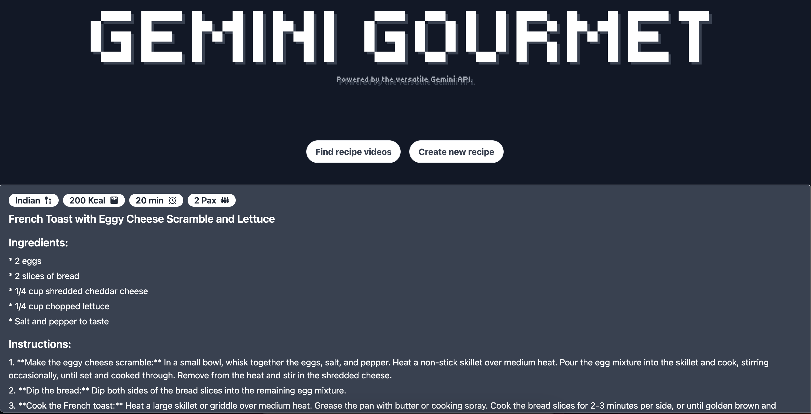

# RecipeGPT

RecipeGPT is a web application that generates recipes based on user-provided ingredients, cuisine type, dietary restrictions, and other preferences. The application uses the latest Gemini AI API from google. The application further uses Youtube Data API V3 to fetch videos based on the recipe generated.

## Table of Contents
- [Features](#features)
- [Demo](#demo)
- [Installation](#installation)
- [Usage](#usage)
- [API](#api)

## Features
- Add ingredients to the list.
- Select cuisine type and dietary restrictions.
- Specify calorie count, cooking time, and serving size.
- Generate a recipe based on the provided information.
- View the generated recipe with detailed instructions.
- Fetch youtube videos based on the recipe.

## Demo
Below are snippets from the site.





## Installation

### Prerequisites
- Node.js
- npm (Node Package Manager)
- Gemini API Key
  

### Backend Setup
1. Clone the backend and frontend repository:

   ```bash
    git clone https://github.com/NikkkhilRam/gemini-gourmet-be
    cd RecipeGPT/backend
    ```

     ```bash
    git clone https://github.com/NikkkhilRam/gemini-gourmet-be
    cd RecipeGPT/backend
    ```
3. Install the required dependencies on both the repository:

   ```bash
    npm install
    ```

4. Run the backend server and frontend (Vite):
    ```bash
    npm run dev
    ```

## Usage
1. Open your browser and navigate to `http://localhost:5173`.
2. Add ingredients using the input field and clicking the add button.
3. Select the cuisine type and dietary restrictions from the dropdown menus.
4. Optionally, provide calorie count, cooking time, and serving size.
5. Click the "GENERATE RECIPE" button to generate a recipe.
6. View the generated recipe with detailed instructions.
7. Further click on Video Recipe videos for youtube video suggestions.

## API
The backend API is built using Gemini AI API and provides an endpoint to generate recipes.

### Endpoint
- `POST /api/recipes/generate`
- `POST /api/yt/videos` 


